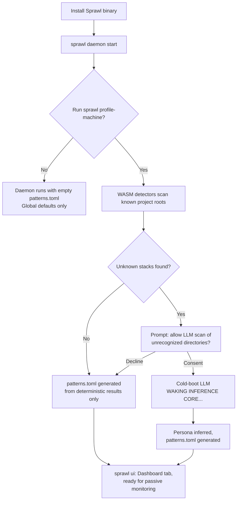
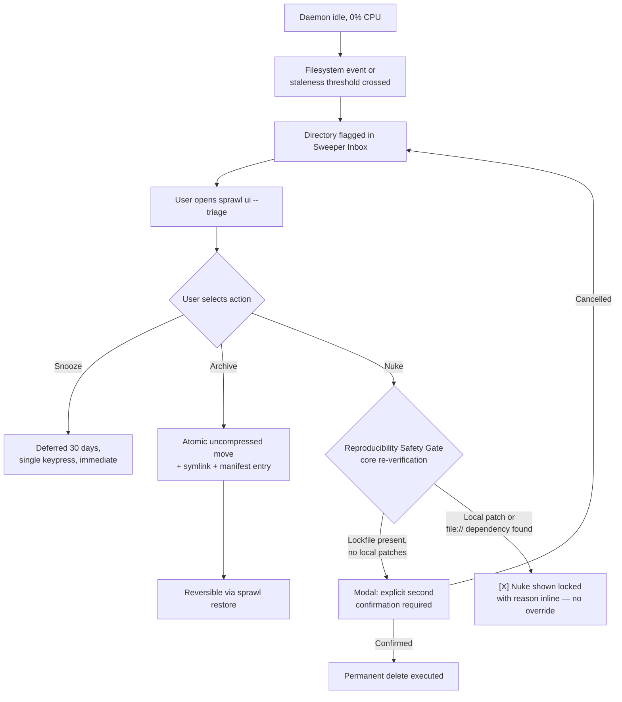
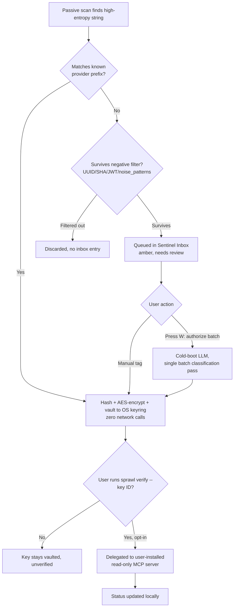
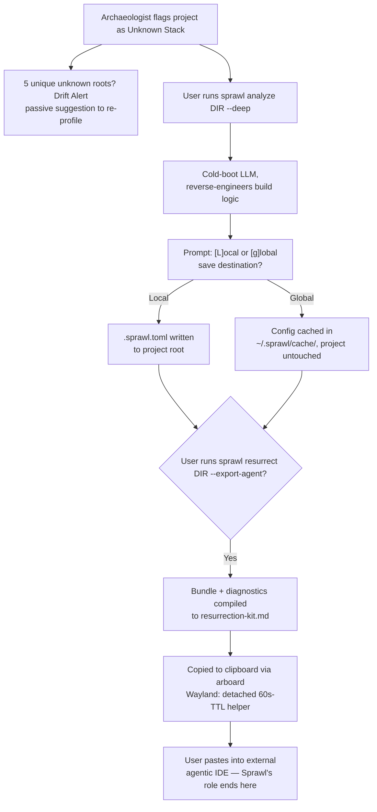
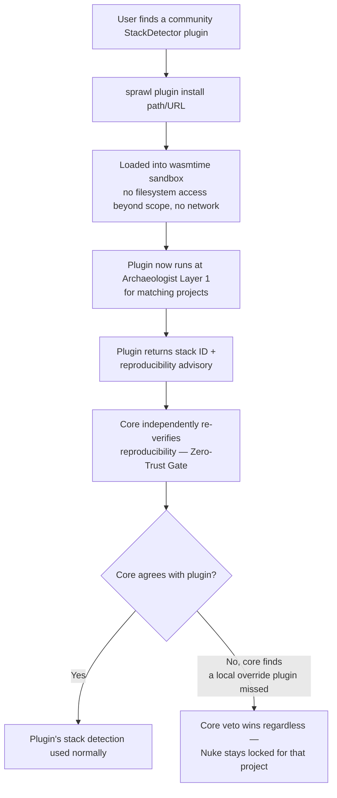

# Sprawl — User Flow Diagrams

Five flows covering the journeys a real user actually takes through Sprawl, from first install through the highest-risk action in the system. Each diagram's decision points map directly to the consent gates and safety invariants defined in the Design Spec — none of these flows have a path that skips a gate.

---

## 1. First-Run Onboarding

**Key point:** the LLM step is reachable only through an explicit consent prompt (H); declining is a fully supported path that still produces a usable configuration.

---

## 2. Passive Monitoring → Triage Decision

**Key point:** H is the Zero-Trust invariant — it runs every time, regardless of what any plugin previously reported, and J has no override path.

---

## 3. Token Sentinel: Discovery → Review → Optional Verify

**Key point:** no path from F reaches an LLM without the explicit `[W]` keypress in G — this is the fix for the earlier design flaw where ambiguous strings woke the model automatically.

---

## 4. Resurrecting an Undocumented Project

**Key point:** E is a real fork, not a formality — declining "Local" means Sprawl never writes into a directory the user may have under version control without saying so first.

---

## 5. Installing a Community Plugin

**Key point:** installing a community plugin only ever grants *advisory* power — F/G/I show that the plugin can never be the sole authority for a destructive action, no matter how it was written or where it came from.
